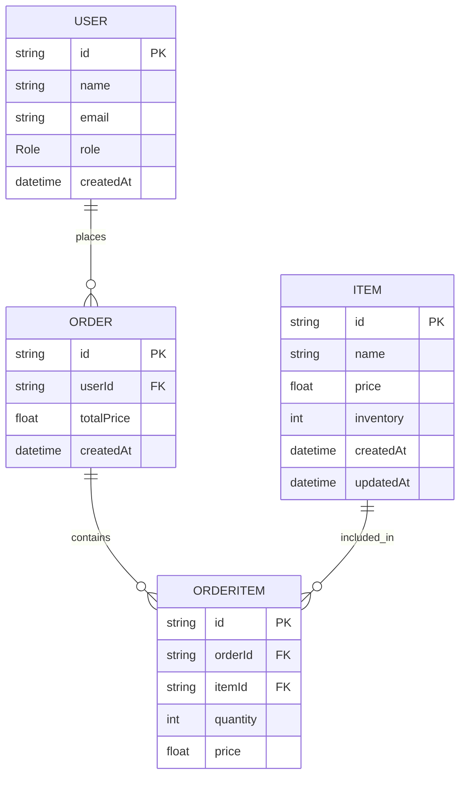

# Grocery Booking System API
Node.js (TypeScript) REST API for a grocery booking system with inventory management, order processing, and Dockerized PostgreSQL setup.

## Tech Stack
- Node.js + Express
- TypeScript
- PostgreSQL
- Prisma ORM
- Docker

## Setup Instructions
```bash
git clone https://github.com/sumuongit/grocery-booking-system.git
npm install
cp .env.example .env
docker-compose up -d
npx prisma migrate dev
npm run dev
```

## Database Schema (ER Diagram)


## API Endpoints

### Public
- Get Items: GET /api/items

### Admin
Header:
- x-role: ADMIN

- Create Item: POST /api/admin/items
- Update Item: PATCH /api/admin/items/{id}
- Delete Item: DELETE /api/admin/items/{id}
- Update Inventory: PATCH /api/admin/items/{id}/inventory

### User
- A mock user is used to simulate authenticated requests
- All order operations are performed using a predefined user ID

Mock User:
- ID: 11111111-1111-1111-1111-111111111111
- x-role: USER

- Place Order: POST /api/user/orders

### Seed Data
Run the following to create a mock user required for order placement:

```bash
npx ts-node src/scripts/seed.ts
```

## Sample Request
POST /api/admin/items
```json
{
  "name": "Rice",
  "price": 50,
  "inventory": 100
}
```
POST /api/user/orders

```json
{
  "items": [
    { "itemId": "9d114ad2-0bae-44bd-a57c-4e675784e365", "quantity": 5 },
    { "itemId": "29af2c28-2d85-4bb0-bed8-18fd7beac30a", "quantity": 1 }
  ]
}
```

## API Testing

Postman collection is available at:

/docs/postman_collection.json

Import into Postman and set:
- base_url: http://localhost:5000/api
- Replace `{id}` with the item ID returned from the create API

## Notes
- Simple role-based authorization implemented via header
- Input validation handled at controller level
- Modular structure (controller/service/routes)
- Prisma used for type-safe database access