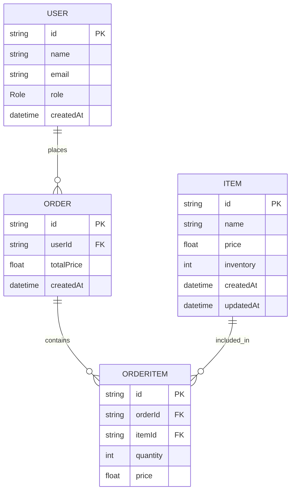

# Grocery Booking System API
Node.js (TypeScript) REST API for a grocery booking system with inventory management, transactional order processing, and fully Dockerized deployment.

## Tech Stack
- Node.js + Express
- TypeScript
- PostgreSQL
- Prisma ORM
- Docker

## Setup Instructions (Docker)
1. **Clone the repository**
   ```bash
   git clone https://github.com/sumuongit/grocery-booking-system.git
   cd grocery-booking-system
   ```

2. **Environment Setup**      
   ```bash
   cp .env.example .env
   ```
   - For Docker, ensure:  `DATABASE_URL=postgresql://postgres:postgres@db:5432/grocery`

3. **Run the Application (App + DB)**
   ```bash
   docker-compose up --build -d
   ```
   - API will be available at: http://localhost:5000 (base URL: /api)

4. **Run Database Migrations**
   ```bash
   docker-compose exec app npx prisma migrate deploy
   ```

5. **Seed the Database**
   ```bash
   docker-compose exec app npx prisma db seed
   ```

## Run Locally (Optional)
1. **Install dependencies**
   ```bash
   npm install
   ```

2. **Environment Setup**      
   ```bash
   cp .env.example .env
   ```
   - Update `DATABASE_URL` if needed

3. **Start the Database**
   ```bash
   docker-compose up -d db
   ```

4. **Initialize Database & Seed Data**
   ```bash
   npx prisma migrate dev
   npx prisma db seed
   ```

5. **Run the Application**
   ```bash
   npm run dev
   ```

## Running Tests
```bash
npm test
```
- Tests are executed locally using Jest. Ensure the database is running (via Docker or locally).

### API Testing
**Import the Postman collection located at:**
`/docs/postman_collection.json`

**Variables**
- **base_url:** http://localhost:5000/api
- **id:** Replace with actual item ID

## Database Schema (ER Diagram)


## API Endpoints

### Public
Both Admin and User roles use the same endpoint to view available grocery items.
- **Get Items:** GET /api/items

### Admin
Header: x-role: ADMIN

- **Create Item:** POST /api/admin/items
- **Update Item:** PATCH /api/admin/items/{id}
- **Delete Item:** DELETE /api/admin/items/{id}
- **Update Inventory:** PATCH /api/admin/items/{id}/inventory

### User
Header: x-role: USER

- **Place Order:** POST /api/user/orders

**Mock User:**
- A mock user is used to simulate authenticated requests
- All order operations are performed using a predefined user ID: 11111111-1111-1111-1111-111111111111

## Sample Request
POST /api/admin/items

```json
{   
   "name": "Soap",
   "price": 70.00,
   "inventory": 150
}
```
POST /api/user/orders

```json
{
  "items": [
    { "itemId": "550e8400-e29b-41d4-a716-446655440000", "quantity": 2 },
    { "itemId": "550e8400-e29b-41d4-a716-446655440001", "quantity": 3 }    
  ]
}
```

## Notes
- Role-based authorization via request header
- Centralized error handling middleware
- Logging implemented using Winston
- Input validation handled at controller level
- Modular architecture (controller/service/routes)
- Prisma ORM for type-safe database access
- Order processing uses database transactions for consistency

## Design Decisions
 - **Transactions:** Prisma $transaction ensures atomic order creation and inventory updates.
 - **Concurrency:** Inventory is validated before deduction to prevent overselling.
 - **Auth Simulation:** Custom headers (x-role) simulate RBAC as per assignment scope.