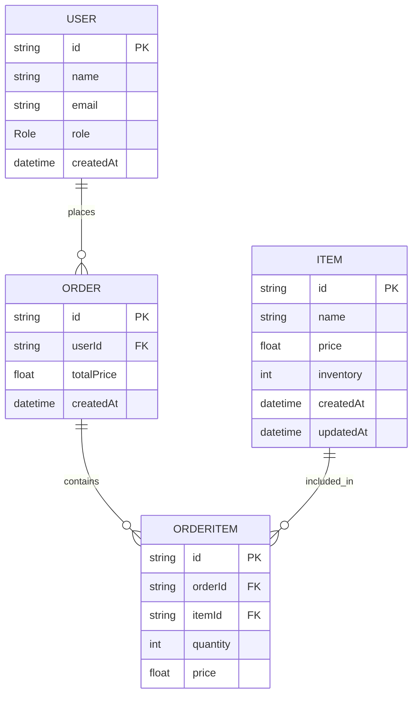

# Grocery Booking System API
Node.js (TypeScript) REST API for a grocery booking system with inventory management, transactional order processing, and Dockerized PostgreSQL setup.

## Tech Stack
- Node.js + Express
- TypeScript
- PostgreSQL
- Prisma ORM
- Docker

## Setup Instructions
1. **Clone the repository**
   ```bash
   git clone https://github.com/sumuongit/grocery-booking-system.git
   cd grocery-booking-system
   ```

2. **Install dependencies**
   ```bash
   npm install
   ```

3. **Environment Setup**
   - Copy `.env.example` to a new file named `.env`
   - Adjust `DATABASE_URL`
   ```bash
   cp .env.example .env
   ```

4. **Start the Database**
   ```bash
   docker-compose up -d
   ```

5. **Initialize Database & Seed Data**
   ```bash
   npx prisma migrate dev
   npx prisma db seed
   ```

6. **Run the Application**
   ```bash
   npm run dev
   ```

## Running Tests
```bash
npm test
```

### API Testing
Import the Postman collection located at:
`/docs/postman_collection.json`

Variables
- base_url: http://localhost:5000/api
- id: Replace with the item ID returned from the create API

## Database Schema (ER Diagram)


## API Endpoints

### Public
Both Admin and User roles use the same endpoint to view available grocery items.
- Get Items: GET /api/items

### Admin
Header: x-role: ADMIN

- Create Item: POST /api/admin/items
- Update Item: PATCH /api/admin/items/{id}
- Delete Item: DELETE /api/admin/items/{id}
- Update Inventory: PATCH /api/admin/items/{id}/inventory

### User
Header: x-role: USER

- Place Order: POST /api/user/orders

Mock User:
- A mock user is used to simulate authenticated requests
- All order operations are performed using a predefined user ID: 11111111-1111-1111-1111-111111111111

## Sample Request
POST /api/admin/items

```json
{
   "id": "550e8400-e29b-41d4-a716-446655440000",
   "name": "Soap",
   "price": 70.00,
   "inventory": 150
}
```
POST /api/user/orders

```json
{
  "items": [
    { "itemId": "550e8400-e29b-41d4-a716-446655440000", "quantity": 2 },
    { "itemId": "550e8400-e29b-41d4-a716-446655440001", "quantity": 3 }    
  ]
}
```

## Notes
- Simple role-based authorization implemented via header
- Input validation handled at controller level
- Basic logging is implemented using Winston for error tracking and key events
- Modular structure (controller/service/routes)
- Prisma used for type-safe database access
- Order creation is handled within a database transaction to ensure data consistency